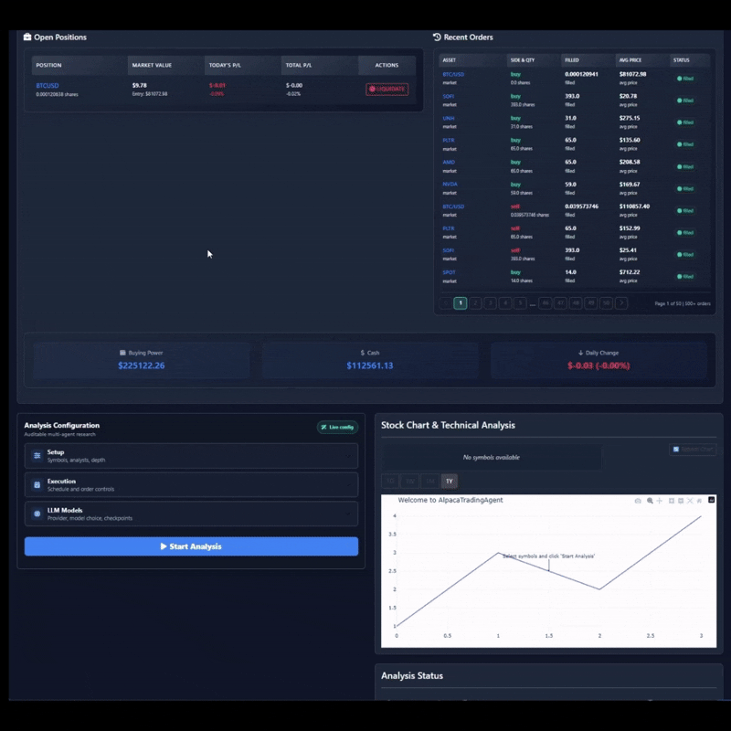
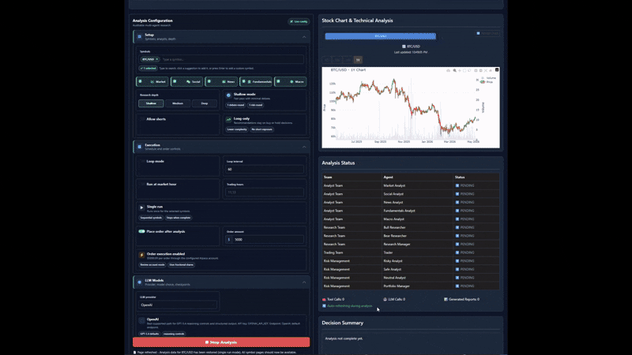
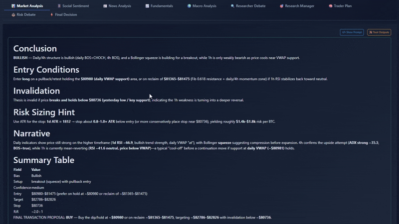

# AlpacaTradingAgent: Enhanced Multi-Agent Alpaca Trading Framework

> 🚀 **AlpacaTradingAgent** - An independent enhanced version built upon the original TradingAgents framework, specifically designed for Alpaca users who want to test or use AI agents to trade on their Alpaca accounts.
>
> This project is an independent upgrade inspired by the original [TradingAgents](https://github.com/TauricResearch/TradingAgents) framework by Tauric Research, extending it with real-time Alpaca integration, crypto support, automated trading capabilities, and an enhanced web interface.
> 
> **Disclaimer**: This project is provided solely for educational and research purposes. It is not financial, investment, or trading advice. Trading involves risk, and users should conduct their own due diligence before making any trading decisions.

<div align="center">

🚀 [Enhanced Features](#enhanced-features) | 🖥️ [The App](#the-app-dashboard-and-trading-desk-ui) | 📐 [Options Alpha](#options-alpha-autonomous-defined-risk-options-overlay) | ⚡ [Installation & Setup](#installation-and-setup) | 📦 [Package Usage](#alpacatradingagent-package) | 🌐 [Web Interface](#web-ui-usage) | 📖 [Complete Guide](#complete-guide) | 🤝 [Contributing](#contributing) | 📄 [Citation](#citation)

⏱️ New here? **[QUICKSTART.md](QUICKSTART.md)** — first analysis in ~5 minutes · 🏗️ **[ARCHITECTURE.md](ARCHITECTURE.md)** — how the pipeline works inside

</div>

## Enhanced Features

AlpacaTradingAgent introduces powerful new capabilities specifically designed for Alpaca users:

### 🔄 **Real-Time Alpaca Integration**
- **Live Trading**: Direct integration with Alpaca API for real-time trading execution
- **Paper & Live Trading**: Support for both paper trading (testing) and live trading with real money
- **Margin Trading**: Full support for margin accounts, including short selling capabilities
- **Portfolio Management**: Real-time portfolio tracking, position monitoring, and order management

### 📈 **Dual Asset Support: Stocks & Crypto**
- **Multi-Asset Analysis**: Analyze both traditional stocks and cryptocurrencies in a single session
- **Crypto Format**: Use proper crypto format (e.g., `BTC/USD`, `ETH/USD`) for cryptocurrency analysis
- **Mixed Portfolios**: Support for mixed symbol inputs like `"NVDA, ETH/USD, AAPL"` for diversified analysis
- **Dedicated Data Sources**: CoinDesk/CryptoCompare-compatible crypto news and DeFi Llama for fundamental crypto data

### 🤖 **Enhanced Multi-Agent System (5 Agents)**
- **Market Analyst**: Evaluates overall market conditions and trends
- **Social Sentiment Analyst**: Analyzes social media sentiment and public opinion
- **News Analyst**: Monitors and interprets financial news and events
- **Fundamental Analyst**: Assesses company financials and intrinsic value
- **Macro Analyst**: Analyzes macroeconomic indicators and Federal Reserve data
- **Parallel Execution**: All 5 analysts run simultaneously for faster analysis with configurable delays to prevent API overload

### 🧠 **Multi-Provider LLM Runtime**
- **Current OpenAI Catalog**: Supports GPT-5.6 Sol/Terra/Luna, GPT-5.5, and GPT-5.4; cost-safe defaults remain `gpt-5.4-nano` and `gpt-5.4-mini`
- **Provider Choice**: Supports OpenAI, local OpenAI-compatible endpoints, Google Gemini, Anthropic Claude, xAI, MiniMax, DeepSeek, Qwen, GLM, OpenRouter, Ollama, and Azure OpenAI
- **Provider-Specific Controls**: Preserves GPT reasoning controls, Gemini thinking level, Claude effort, custom model IDs, and Azure deployment names
- **Local Compatibility**: `OPENAI_USE_LOCAL` and `OPENAI_BASE_URL` continue to route core LLM calls to a local OpenAI-compatible backend

### 🧾 **Structured Decisions, Memory, and Resume**
- **Executable Final Action**: Final decisions preserve `BUY/HOLD/SELL` or `LONG/NEUTRAL/SHORT` for Alpaca execution
- **Advisory Ratings**: Upstream-style ratings are treated as metadata only and never directly trigger Alpaca orders
- **Structured Output Fallback**: Research Manager, Trader, and Risk Manager use structured schemas where supported and gracefully retry as free text otherwise
- **Persistent Decision Log**: Completed decisions are written to a markdown memory log and later resolved with realized returns and reflections
- **Checkpoint Resume**: Optional per-symbol SQLite checkpoints allow failed LangGraph runs to resume while successful runs clean up automatically
- **Safe Paths**: Report, cache, checkpoint, and log paths use safe ticker components, including crypto symbols like `BTC/USD -> BTC_USD`

### ⚡ **Automated Trading & Scheduling**
- **Market Hours Trading**: Automatic execution during market hours
- **Scheduled Analysis**: Configurable recurring analysis every N hours
- **Auto-Execution**: Optional automatic trade execution based on agent recommendations
- **Smart Scheduling**: Respects market hours for different asset classes

### 🌐 **Advanced Web Interface**
- **Multi-Symbol Dashboard**: Analyze and trade multiple symbols simultaneously
- **Progress Tracking**: Real-time progress table showing analysis status for each symbol
- **Interactive Charts**: Live Alpaca data integration with technical indicators
- **Tabbed Reports**: Organized analysis reports with easy navigation
- **Chat-Style Debates**: Visualize agent debates as conversation threads
- **Position Management**: View current positions, recent orders, and liquidate positions directly from UI
- **Model Configuration**: Choose provider, model, provider-specific parameters, output language, and checkpoint resume from the UI

## Complete Guide

For an in-depth, step-by-step walkthrough of using the AlpacaTradingAgent web UI for automated trading, check out the complete guide on Dev.to:

* **[Complete Guide: Using AlpacaTradingAgent Web UI for Automated Trading](https://dev.to/aarontrng/complete-guide-using-alpacatradingagent-web-ui-for-automated-trading-3k78)**

## AlpacaTradingAgent Framework

AlpacaTradingAgent is a multi-agent trading framework that mirrors the dynamics of real-world trading firms. By deploying specialized LLM-powered agents working collaboratively, the platform evaluates market conditions across multiple asset classes and executes informed trading decisions through the Alpaca API.

<p align="center">
  
</p>

> AlpacaTradingAgent framework is designed for research and educational purposes. Trading performance may vary based on many factors, including the chosen backbone language models, model temperature, trading periods, the quality of data, and other non-deterministic factors. [It is not intended as financial, investment, or trading advice.](https://tauric.ai/disclaimer/)

Our enhanced framework decomposes complex trading tasks into specialized roles while providing real-time market connectivity and execution capabilities.

### Enhanced Analyst Team (5 Agents)
- **Market Analyst**: Evaluates overall market conditions, sector trends, and market sentiment indicators
- **Social Sentiment Analyst**: Analyzes Reddit, OpenAI web-search sentiment, and public market narratives
- **News Analyst**: Monitors financial news, earnings announcements, and global events that impact markets
- **Fundamental Analyst**: Evaluates company financials, earnings reports, and intrinsic value calculations
- **Macro Analyst**: Analyzes Federal Reserve data, economic indicators, and macroeconomic trends using FRED API

### Researcher Team
- Comprises both bullish and bearish researchers who critically assess the insights provided by the Analyst Team. Through structured debates, they balance potential gains against inherent risks, now with enhanced support for both equity and crypto markets.

### Trader Agent
- Composes reports from analysts and researchers to make informed trading decisions. Determines timing, magnitude, and direction (long/short) of trades with direct execution through Alpaca API.

### Risk Management and Portfolio Manager
- Continuously evaluates portfolio risk across stocks and crypto assets. Monitors margin requirements, position sizes, and overall portfolio exposure. Provides real-time risk assessment and position management through the Alpaca integration.

## The App: Dashboard and Trading Desk UI

The Web UI is a navigable application, not a single scrolling page. A fixed
sidebar routes between seven workspaces; a sticky top bar keeps live account
equity, day P/L, buying power, market status, and the paper/live badge visible
from every page.

| Workspace | What it is for |
| --- | --- |
| **Dashboard** | Live KPIs, allocation donut, agent pipeline, positions, options overlay, decisions, orders |
| **Run Analysis** | Configure the agent team, symbols, research depth, and launch a run |
| **Agent Reports** | Full audit trail — one tab per agent, including the Options tab |
| **Options Desk** | Proposals, risk-gate verdicts, open contracts, and IV history |
| **Positions & Orders** | Live Alpaca positions, order history, account detail |
| **Backtest** | Replay strategies over historical data |
| **Settings** | API credentials, safety guardrails, LLM cost monitor |

### Dashboard

Six KPI tiles (equity, day P/L, open P/L, buying power, gross exposure, options
positions), a portfolio allocation donut that labels short legs as short, a live
**agent pipeline** grouped by stage that shows exactly which agent is running,
and tables for positions, decisions, and recent orders. Options positions are
detected by OCC symbol and tagged `OPT LONG` / `OPT SHORT` so a short leg is
never displayed as another long.

### Options Desk

The page built for interrogation. Alongside the model's proposal it shows the
**risk gate's own recomputed numbers** — worst case, risk-sized loss, net
premium, collateral — plus a live list of the gate rules currently in force. The
separation between what the LLM suggested and what arithmetic verified is
visible on screen rather than asserted in a README.

### Design notes

- **State is honest.** When Alpaca is not connected the UI says so and points at
  Settings. It never renders a confident `$0.00`, which is what the risk gate's
  deliberate fail-closed zeros would otherwise look like.
- **Navigation preserves state.** Pages are hidden rather than unmounted, so a
  run in progress keeps streaming while you move between workspaces.
- **No hard CDN dependency for layout.** The shell, grid, tables, and tab strip
  are styled by the app's own stylesheet, so the layout survives a slow or
  blocked CDN rather than collapsing into unstyled markup.
- **Responsive.** Below 860px the sidebar collapses to an icon rail and panels
  reflow to a single column.

## Options Alpha: Autonomous Defined-Risk Options Overlay

The **Options Strategist** runs between the Trader and the risk debate. It turns the
Trader's directional signal into a *defined-risk options structure*, then hands that
structure to a deterministic risk gate that can veto it. The LLM chooses the shape of
the trade; arithmetic over live quotes decides whether it is allowed and what it costs.

### The pipeline

```
Analysts → Researchers → Research Manager → Trader
                                              │
                                              ▼
                                    Options Strategist  ── LLM picks a structure
                                              │
                                              ▼
                                    Options Risk Gate   ── deterministic veto
                                              │
                                              ▼
                                    Risk Debate → Risk Judge
                                              │
                                              ▼
                              Direction reconciliation → Alpaca MLEG order
```

### Where the AI stops and arithmetic starts

This split is the core design decision. The model is good at reading market context and
choosing a structure; it is not a source of truth for numbers that decide risk.

| Decision | Owner |
| --- | --- |
| Which structure to trade (long call, vertical, condor, CSP…) | LLM |
| Which strikes and expiries | LLM, restricted to contracts present in the live chain |
| Net premium of the position | **Recomputed from live bid/ask**, never the model's estimate |
| Max loss and position sizing | **Recomputed from strikes and live premium** |
| The order's limit price | **Derived from the gate's premium**, not the model's estimate |
| Whether the trade is allowed at all | **Deterministic risk gate** |

A model that hallucinates a $99.99 premium on a $2.55 spread cannot move the order price
by a cent — there is a regression test that asserts exactly this.

### Risk gate rules

Every rule is arithmetic over the live chain, and any single failure vetoes the trade:

- **No undefined risk.** Every short leg must be paired with a long leg of the same type
  and expiry at a different strike, or the position must be fully collateralized
  (cash-secured put, covered call). A naked short leg is never submitted.
- **Loss cap.** Risk-sized loss must stay under `OPTIONS_MAX_LOSS_PCT` of account equity.
- **Liquidity.** Any leg whose bid-ask spread exceeds `OPTIONS_MAX_SPREAD_PCT` of its mid
  is rejected. Missing or zero quotes are rejected rather than assumed.
- **Buying power and collateral.** Net debits are checked against buying power; a
  cash-secured put must be fully cash-collateralized; a covered call must be backed by
  100 real shares per contract, verified against live Alpaca positions.
- **Direction reconciliation.** The risk judge may flip the signal after the strategist
  ran. A plan whose direction no longer matches the final decision is dropped, not sent.
- **Fail-closed re-check.** The executor re-runs the whole gate against fresh quotes
  immediately before submitting. Approval at proposal time is not approval at order time.

#### Honest worst-case reporting

A cash-secured put's true worst case is assignment with the stock at zero. That number is
honest but useless for sizing — applied literally it would veto every CSP ever written.
So the gate reports **both**:

- `max_loss_usd` — the real worst case, to zero, less the credit.
- `stress_loss_usd` — the loss at `OPTIONS_STRESS_MOVE_PCT` below the short strike, which
  is what the equity limit is actually applied to.

For every defined-risk structure the two are identical. They only diverge for
collateralized shorts, which is exactly where a single number would mislead.

#### IV rank and IV percentile are not the same number

- **IV rank** = `(iv − min) / (max − min) × 100` — where vol sits in its own range.
- **IV percentile** = fraction of past observations below current IV.

A series with one volatility spike produces a *low rank* and a *high percentile*
simultaneously. That is precisely the case where "high IV, sell premium" is the wrong
read, so the strategist is shown both and told to trust the percentile when they disagree.

IV rank needs history to mean anything. The context reports how many observations stand
behind it, and below `OPTIONS_MIN_IV_HISTORY_DAYS` the model is told the rank is
unreliable and steered toward long-premium structures. Build that history before trading:

```bash
python scripts/record_iv_history.py --symbols SPY QQQ AAPL MSFT NVDA
```

Run it once a day (cron or CI). It records one true ATM implied-volatility observation per
symbol — the average of the ATM call and put in the front expiry, not whichever contract
happened to come back first.

### Enabling it

Options trading is off by default. In `.env`:

```bash
OPTIONS_TRADING_ENABLED=True
OPTIONS_DTE_MIN=7            # expiration window scanned, in days
OPTIONS_DTE_MAX=45
OPTIONS_MAX_LOSS_PCT=2.0     # risk-sized loss cap, % of equity
OPTIONS_MAX_SPREAD_PCT=20.0  # reject legs wider than this % of mid
OPTIONS_STRESS_MOVE_PCT=20.0 # adverse move used to size collateralized shorts
OPTIONS_MAX_CONTRACTS=1      # spread units per trade
```

When enabled, the **Options Strategist** node is added to the graph, an **📐 Options** tab
appears in the Web UI showing the structure, the gate's recomputed numbers, and the actual
order outcome, and approved plans are submitted to Alpaca as multi-leg (MLEG) orders.

> Options trading involves substantial risk and is not suitable for every investor. This
> overlay is built and tested against Alpaca's **paper** trading environment. Read
> [Characteristics and Risks of Standardized Options](https://www.theocc.com/company-information/documents-and-archives/options-disclosure-document)
> before trading options with real capital.

## Installation and Setup

### Installation

Clone AlpacaTradingAgent:
```bash
git clone https://github.com/huygiatrng/AlpacaTradingAgent.git
cd AlpacaTradingAgent
```

Install dependencies:
```bash
pip install -r requirements.txt
```

### Required APIs Configuration

For full functionality including real-time trading, you'll need to set up the following API keys:

1. **Copy the sample environment file**:
   ```bash
   cp env.sample .env
   ```

2. **Edit the `.env` file** with your API keys:

#### Essential APIs
- **Alpaca API Keys** (Required for trading):
  - Sign up at [Alpaca Markets](https://app.alpaca.markets/signup)
  - Get your API key and secret from the dashboard
  - Set `ALPACA_USE_PAPER=True` for paper trading (recommended for testing)
  - Set `ALPACA_USE_PAPER=False` for live trading with real money

- **OpenAI API Key** (Default LLM provider and OpenAI web-search tools):
  - Sign up at [OpenAI Platform](https://platform.openai.com/api-keys)
  - Default models are `gpt-5.4-nano` and `gpt-5.4-mini`

#### LLM Provider APIs
Set `LLM_PROVIDER` in `.env`, the CLI, or the WebUI. Supported providers include:
- **OpenAI**: `OPENAI_API_KEY`
- **Local OpenAI-compatible**: `OPENAI_USE_LOCAL=true`, `OPENAI_BASE_URL`, optional `OPENAI_API_KEY`
- **Google Gemini**: `GOOGLE_API_KEY`
- **Anthropic Claude**: `ANTHROPIC_API_KEY`
- **xAI Grok**: `XAI_API_KEY`
- **MiniMax**: `MINIMAX_API_KEY` (defaults to `https://api.minimax.io/v1`)
- **DeepSeek**: `DEEPSEEK_API_KEY`
- **Qwen/DashScope**: `DASHSCOPE_API_KEY`
- **GLM/Zhipu**: `ZHIPU_API_KEY`
- **OpenRouter**: `OPENROUTER_API_KEY`
- **Ollama**: no API key by default; configure the backend URL
- **Azure OpenAI**: `AZURE_OPENAI_API_KEY`, `AZURE_OPENAI_ENDPOINT`, `AZURE_OPENAI_DEPLOYMENT_NAME`, `AZURE_OPENAI_API_VERSION`

#### Financial Data APIs
- **Finnhub API Key** (Required for stock news and data):
  - Sign up at [Finnhub](https://finnhub.io/register)

- **FRED API Key** (Required for macro analysis):
  - Get your free key from [FRED](https://fred.stlouisfed.org/docs/api/api_key.html)

#### Crypto Data APIs
- **CoinDesk/CryptoCompare API Key** (Required for crypto news):
  - Sign up at [CryptoCompare](https://www.cryptocompare.com/cryptopian/api-keys)

#### Optional APIs
- **Alpha Vantage API Key** (Optional fallback market data):
  - Get from [Alpha Vantage](https://www.alphavantage.co/support/#api-key)
  - Fallback routing is optional and does not replace Alpaca as the primary market data path

#### Runtime Paths
`env.sample` also documents optional runtime paths:
- `TRADINGAGENTS_RESULTS_DIR` for report output
- `TRADINGAGENTS_CACHE_DIR` for cache and checkpoint files
- `TRADINGAGENTS_MEMORY_LOG_PATH` for persistent decision memory

3. **Restart the application** after setting up your API keys.

> **Note**: Without valid Alpaca API keys, the application will fall back to demo mode without trading capabilities.

### CLI Usage

You can try out the CLI by running:
```bash
python -m cli.main
```

The CLI now supports multiple symbols and crypto assets:
- Single stock: `NVDA`
- Single crypto: `BTC/USD`
- Multiple mixed assets: `NVDA, ETH/USD, AAPL, BTC/USD`
- Provider/model selection, custom model IDs, checkpoint resume, and provider-specific settings are available from the CLI prompts.

### Web UI Usage

Launch the enhanced Dash-based web interface:

```bash
python run_webui_dash.py
```

Common options:
- `--port PORT`: Specify a custom port (default: 7860)
- `--share`: Create a public link to share with others
- `--server-name`: Specify the server name/IP to bind to (default: 127.0.0.1)
- `--debug`: Run in debug mode with more logging
- `--max-threads N`: Set the maximum number of threads (default: 40)

or launch it with Docker:

```bash
cp env.sample .env
# Edit .env with your provider, market data, and Alpaca credentials first.
docker compose up -d --build
```

This starts a local web server at http://localhost:7860. To use a different
host port, set `HOST_PORT`, for example `HOST_PORT=7861 docker compose up -d --build`.

### Prompt Customization

Model-facing prompts live in `tradingagents/prompts/templates`. Edit those
Markdown templates to tune analyst, researcher, trader, risk, signal extraction,
and reflection behavior from one place. Templates are grouped by role:
`analysts/`, `researchers/`, `managers/`, `trader/`, `risk/`, `trading_modes/`,
`graph/`, and `shared/`.

To keep custom prompts outside the repo, copy selected templates to another
folder and set `TRADINGAGENTS_PROMPT_DIR` to that path. Keep the same group path
for overrides, for example `analysts/market_system.md`. Missing files fall back
to the bundled templates.

#### Enhanced Web UI Features

The web interface offers comprehensive trading and analysis capabilities:

**Multi-Asset Analysis Dashboard**
- Analyze multiple stocks and crypto assets simultaneously
- Real-time progress tracking for each symbol
- Support for mixed portfolios (e.g., `"NVDA, ETH/USD, AAPL"`)

<p align="center">
  
</p>

**Live Trading Integration**
- View current Alpaca positions and recent orders
- Execute trades directly from the interface
- Liquidate positions with one-click functionality
- Real-time portfolio value tracking

<p align="center">
  
</p>

**Interactive Charts & Data**
- Live price charts powered by Alpaca API
- Technical indicators and analysis overlays
- Support for both stock and crypto price data

**Enhanced Reporting Interface**
- Tabbed navigation for different analysis reports
- Chat-style conversation view for agent debates
- Progress table showing analysis status for each symbol
- Downloadable reports and trade recommendations

<p align="center">
  
</p>

**Automated Trading Controls**
- Schedule recurring analysis during market hours
- Configure auto-execution of trade recommendations
- Set custom analysis intervals (every N hours)
- Margin trading controls and risk management

**LLM and Runtime Controls**
- Select OpenAI, local OpenAI-compatible, Google, Anthropic, xAI, MiniMax, DeepSeek, Qwen, GLM, OpenRouter, Ollama, or Azure OpenAI
- Configure custom model IDs for every major cloud provider and Azure deployment names, so newly released chat models work before the static catalog is refreshed
- Tune GPT reasoning controls, Gemini thinking level, Claude effort, output language, and checkpoint resume

## AlpacaTradingAgent Package

### Implementation Details

Built with LangGraph for flexibility and modularity. The enhanced version integrates with multiple financial APIs and supports both paper and live trading through Alpaca. We recommend `gpt-5-nano` for the cheapest testing runs or `gpt-5.4-nano` for a newer low-cost default, as the framework makes numerous API calls across all 5 agents.

### Python Usage

```python
from tradingagents.graph.trading_graph import TradingAgentsGraph
from tradingagents.default_config import DEFAULT_CONFIG

# Initialize with default config
ta = TradingAgentsGraph(debug=True, config=DEFAULT_CONFIG.copy())

# Analyze a single stock
_, decision = ta.propagate("NVDA", "2024-05-10")
print(decision)

# Analyze multiple assets including crypto
symbols = ["NVDA", "ETH/USD", "AAPL"]
for symbol in symbols:
    _, decision = ta.propagate(symbol, "2024-05-10")
    print(f"{symbol}: {decision}")
```

### Custom Configuration

```python
from tradingagents.graph.trading_graph import TradingAgentsGraph
from tradingagents.default_config import DEFAULT_CONFIG

# Create custom config for enhanced features
config = DEFAULT_CONFIG.copy()
config["deep_think_llm"] = "gpt-5.4-mini"  # Balanced current default
config["quick_think_llm"] = "gpt-5.4-nano"  # New low-cost quick model
config["quick_llm_params"] = {
    "reasoning_effort": "low",
    "text_verbosity": "low",
    "reasoning_summary": "auto",
}
config["deep_llm_params"] = {
    "reasoning_effort": "medium",
    "text_verbosity": "medium",
    "reasoning_summary": "auto",
}
config["max_debate_rounds"] = 2  # Increase debate rounds
config["online_tools"] = True  # Use real-time data
config["allow_shorts"] = False  # Investment mode: BUY/HOLD/SELL
config["checkpoint_enabled"] = False  # Enable to resume failed graph runs
config["memory_log_path"] = "~/.tradingagents/memory/trading_memory.md"
config["news_global_openai_enabled"] = False  # Macro handles broad global context by default

# Parallel execution settings (to avoid API overload)
config["parallel_analysts"] = True  # Run analysts in parallel (default: True)
config["analyst_start_delay"] = 0.5  # Delay between starting each analyst (seconds)
config["analyst_call_delay"] = 0.1  # Delay before making analyst calls (seconds)
config["tool_result_delay"] = 0.2  # Delay between tool results and next call (seconds)

# Initialize with custom config
ta = TradingAgentsGraph(debug=True, config=config)

# Analyze with crypto support
_, decision = ta.propagate("BTC/USD", "2024-05-10")
print(decision)
```

For non-OpenAI providers, switch the provider and model IDs:

```python
config = DEFAULT_CONFIG.copy()
config["llm_provider"] = "google"
config["quick_think_llm"] = "gemini-2.5-flash"
config["deep_think_llm"] = "gemini-3.1-pro-preview"
config["google_thinking_level"] = "high"

ta = TradingAgentsGraph(debug=True, config=config)
_, decision = ta.propagate("NVDA", "2024-05-10")
print(decision)
```

## Contributing

We welcome contributions from the community! AlpacaTradingAgent is an independent project that builds upon concepts from the original TradingAgents framework, continuously evolving with new features for Alpaca integration and multi-asset support.

## Acknowledgments

This project is inspired by and builds upon concepts from the original [TradingAgents](https://github.com/TauricResearch/TradingAgents) framework by Tauric Research. We extend our gratitude to the original authors for their pioneering work in multi-agent financial trading systems.

**AlpacaTradingAgent** is an independent project that focuses specifically on providing Alpaca users with a production-ready trading interface, real-time market connectivity, and expanded asset class support while implementing an enhanced multi-agent architecture.

## Citation

Please reference the original TradingAgents work that inspired this project:

```
@misc{xiao2025tradingagentsmultiagentsllmfinancial,
      title={TradingAgents: Multi-Agents LLM Financial Trading Framework}, 
      author={Yijia Xiao and Edward Sun and Di Luo and Wei Wang},
      year={2025},
      eprint={2412.20138},
      archivePrefix={arXiv},
      primaryClass={q-fin.TR},
      url={https://arxiv.org/abs/2412.20138}, 
}
```
