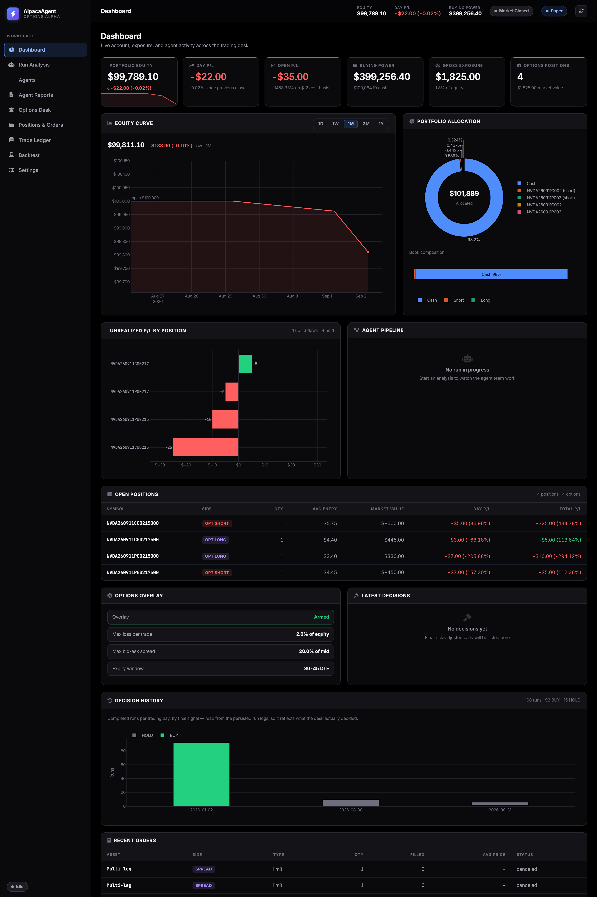
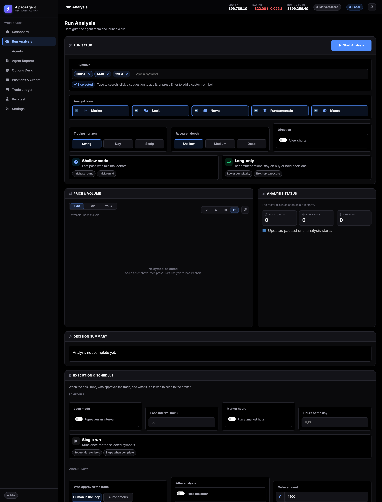
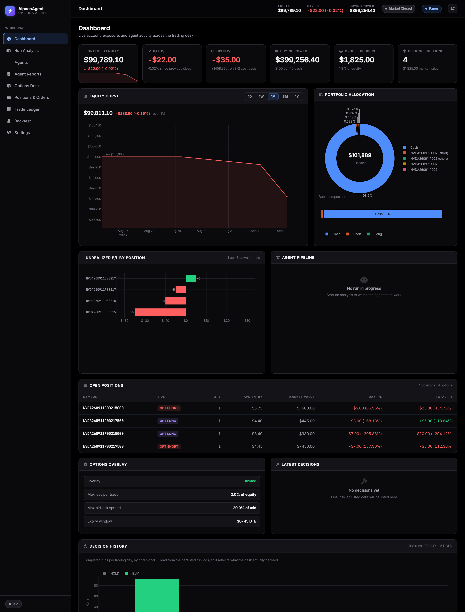
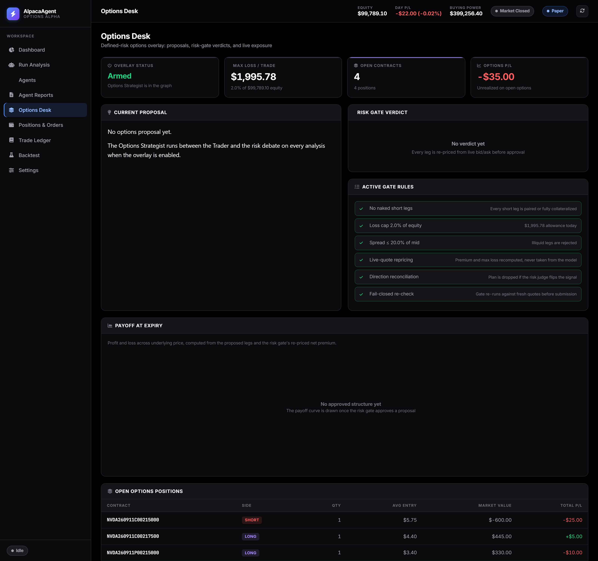
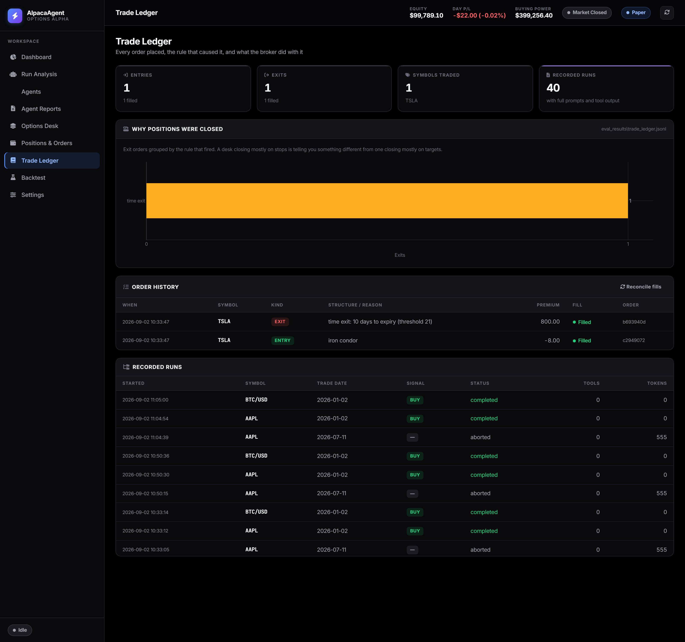

<div align="center">

# Options Alpha

### An autonomous multi-agent options trading desk, built on Alpaca

**14 LLM agents research a position. Arithmetic decides whether it trades.**

Built by [@Aashir01](https://github.com/Aashir01) for the
[Alpaca AI Trading Agents Hackathon](https://lablab.ai/ai-hackathons/alpaca-ai-trading-agents-hackathon)

[](https://www.python.org/)
[](https://alpaca.markets/)
[](https://langchain-ai.github.io/langgraph/)
[](#testing)
[](LICENSE)

**[📄 One-page technical write-up](SUBMISSION.md)** — AI logic, risk gates, Alpaca infrastructure

[Quick Start](#quick-start) · [How It Works](#how-it-works) · [The Risk Gate](#the-risk-gate) ·
[MCP Server](#alpaca-mcp-server) · [The App](#the-app) · [Configuration](#configuration) ·
[Testing](#testing)

📋 **[Team Brief](docs/TEAM_BRIEF.md)** — how every agent talks to every other agent,
what the risk gate computes, and the open strategy questions

</div>

---

## What this is

A trading system where a team of specialised LLM agents debates a position, and a
**deterministic risk gate** — pure arithmetic over live bid/ask — decides whether that
position is allowed to exist, how large it can be, and what price it goes out at.

The agents are good at reading market context and choosing the *shape* of a trade. They are
not a source of truth for the numbers that decide risk. Every figure that could lose money
is recomputed from the live option chain before an order reaches the broker, so a model that
hallucinates a $99.99 premium on a $2.55 spread cannot move the order price by a cent.

Everything runs against **Alpaca's paper trading environment**.

<div align="center">

<em>Live dashboard — account KPIs, allocation, and the agent pipeline mid-run</em>
</div>

---

## How it works

An analysis run is a LangGraph state machine. Fourteen agents, four stages, one gate:

```
                       ┌──────────────────────────────────────┐
   Market ─┐           │  Analysts run in parallel             │
   Social ─┤           │  Each writes an evidence-scored       │
   News   ─┼──────────▶│  report into shared state             │
   Fund.  ─┤           └──────────────────────────────────────┘
   Macro  ─┘                          │
                                      ▼
                     Bull Researcher ⇄ Bear Researcher      ← structured debate
                                      │
                                      ▼
                             Research Manager                ← picks a side
                                      │
                                      ▼
                                   Trader                    ← direction + conviction
                                      │
                                      ▼
                    ╔═════════════════════════════════════╗
                    ║       OPTIONS STRATEGIST            ║  ← LLM picks a structure
                    ║  long call · vertical · condor      ║
                    ║  CSP · covered call · none          ║
                    ╠═════════════════════════════════════╣
                    ║       OPTIONS RISK GATE             ║  ← deterministic veto
                    ║  no naked shorts · loss cap         ║
                    ║  liquidity · collateral · repricing ║
                    ╚═════════════════════════════════════╝
                                      │
                                      ▼
                Risky ⇄ Safe ⇄ Neutral  →  Risk Judge        ← final risk-adjusted call
                                      │
                                      ▼
                       Direction reconciliation
                                      │
                                      ▼
                        Alpaca multi-leg (MLEG) order
```

### Where the AI stops and arithmetic starts

This split is the whole design. It is enforced in code, not by prompt instruction:

| Decision | Owner |
| --- | --- |
| Which structure to trade | **LLM** |
| Which strikes and expiries | **LLM**, restricted to contracts present in the live chain |
| Net premium of the position | **Recomputed from live bid/ask** — never the model's estimate |
| Max loss and position sizing | **Recomputed** from strikes and live premium |
| The order's limit price | **Derived from the gate's premium**, not the model's |
| Whether the trade happens at all | **Deterministic risk gate** |

The Options Strategist proposes off the *Trader's* signal. The Risk Judge may then flip the
signal. Before submission, the executor re-runs the entire gate against fresh quotes and
**drops any plan whose direction no longer matches** the final decision. Approval at proposal
time is not approval at order time.

---

## The Risk Gate

Every rule is arithmetic over the live chain. Any single failure vetoes the trade.

| Rule | What it enforces |
| --- | --- |
| **No undefined risk** | Every short leg must be paired with a long leg of the same type and expiry at a different strike, or be fully collateralized. A naked short is never submitted. |
| **Loss cap** | Risk-sized loss must stay under `OPTIONS_MAX_LOSS_PCT` of account equity. |
| **Liquidity** | Any leg whose bid-ask spread exceeds `OPTIONS_MAX_SPREAD_PCT` of its mid is rejected. Missing or zero quotes are rejected, never assumed. |
| **Buying power** | Net debits are checked against buying power. |
| **Collateral** | A cash-secured put must be fully cash-collateralized; a covered call must be backed by 100 real shares per contract, verified against live Alpaca positions. |
| **Direction reconciliation** | A plan whose direction no longer matches the final risk decision is dropped, not sent. |
| **Fail-closed re-check** | The gate re-runs against fresh quotes immediately before submission. |

<div align="center">

<em>Options Desk — the model's proposal beside the gate's independently recomputed numbers</em>
</div>

### Honest worst-case reporting

A cash-secured put's true worst case is assignment with the stock at zero. That number is
honest but useless for sizing — applied literally it would veto every CSP ever written. So
the gate reports **both**:

- `max_loss_usd` — the real worst case, to zero, less the credit received.
- `stress_loss_usd` — the loss at `OPTIONS_STRESS_MOVE_PCT` below the short strike, which is
  what the equity limit is actually applied to.

For every defined-risk structure the two are identical. They diverge only for collateralized
shorts — exactly where a single number would mislead.

### IV rank and IV percentile are not the same number

- **IV rank** = `(iv − min) / (max − min) × 100` — where volatility sits in its own range.
- **IV percentile** = the fraction of past observations below current IV.

A series containing one volatility spike produces a **low rank and a high percentile at the
same time**. That is precisely the case where "high IV, sell premium" is the wrong read, so
the strategist is shown both and told to trust the percentile when they disagree.

IV rank needs history to mean anything. The market context reports how many observations
stand behind it, and below `OPTIONS_MIN_IV_HISTORY_DAYS` the model is told the rank is
unreliable and steered toward long-premium structures. Build that history before trading:

```bash
python scripts/record_iv_history.py --symbols SPY QQQ AAPL MSFT NVDA
```

Run it once a day (cron or CI). It records one true ATM observation per symbol — the average
of the ATM call and put in the front expiry, not whichever contract happened to return first.

---

## The App

A navigable application, not a single scrolling page. A fixed sidebar routes seven
workspaces; a sticky top bar keeps equity, day P/L, buying power, market status, and the
paper/live badge visible everywhere.

| Workspace | Purpose |
| --- | --- |
| **Dashboard** | Live KPIs, allocation donut, agent pipeline, positions, options overlay, decisions, orders |
| **Run Analysis** | Configure the agent team, symbols, research depth; launch a run |
| **Agent Reports** | Full audit trail — one tab per agent, including the Options tab |
| **Options Desk** | Proposals, risk-gate verdicts, open contracts, IV history depth |
| **Positions & Orders** | Live Alpaca positions, order history, account detail |
| **Backtest** | Replay strategies over historical data |
| **Settings** | API credentials, safety guardrails, LLM cost monitor |

<div align="center">

<em>Run Analysis — symbols, analyst selection, research depth, and execution controls</em>
</div>

**Design decisions worth knowing:**

- **State is honest.** When Alpaca is not connected the UI says so and points at Settings. It
  never renders a confident `$0.00` — which is what the risk gate's deliberate fail-closed
  zeros would otherwise look like.
- **Navigation preserves state.** Pages are hidden rather than unmounted, so a run in
  progress keeps streaming while you move between workspaces.
- **Short legs stay visible.** Options positions are detected by OCC symbol and tagged
  `OPT LONG` / `OPT SHORT`. A short leg is the risk-bearing side of a spread and is never
  displayed as another long.

<div align="center">

<em>Positions, options overlay, and order history — each spread leg keeps its side</em>
</div>

- **No hard CDN dependency for layout.** The shell, grid, tables, and tab strip are styled by
  the app's own stylesheet, so the layout survives a slow or blocked CDN.
- **Responsive.** Below 860px the sidebar collapses to an icon rail and panels reflow.

---

## Positions are managed, not just opened

A defined-risk structure bounds what a position *can* lose. It does nothing about when to
stop losing it. The risk gate sizes a new trade and the safety breakers refuse new orders,
but neither touches capital already committed — so a spread used to ride to expiry whichever
way it went.

`tradingagents/execution/position_manager.py` closes that loop. It groups raw option legs
into structures by underlying and expiry — a four-leg iron condor is **one** position, not
four — and decides from the broker's own cost basis and market value. No model opinion is
involved in an exit, so a hallucinated estimate cannot hold a loser open or close a winner.

| Exit | Credit structures | Debit structures |
|------|-------------------|------------------|
| **Stop** | loss reaches 1.5× the credit received | loss reaches 50% of the premium paid |
| **Profit** | 35% of the premium captured | 35% of the premium captured |
| **Time** | 21 days to expiry | 21 days to expiry |

Credit and debit need different stops: a debit spread cannot lose more than it cost, so a
"1.5× the premium" stop could never fire on one.

Closes go out as a **single MLEG order**. Closing a condor leg by leg can partially fill and
leave a naked short — precisely the exposure the defined-risk structure existed to avoid.

The loss breakers **flatten** rather than only veto: refusing to open is no protection for
money already at risk, so a tripped daily-loss or drawdown breaker closes everything and
engages the kill switch. The kill switch itself deliberately does not flatten — it means
"stop trading", not "liquidate a book someone may have halted precisely to leave alone".

Exits run on a systemd timer, not inside the agent graph. **A stop that only fires when an
analysis happens to be running is not a stop.** The runner asks Alpaca whether the market is
open rather than hard-coding hours, so it is immune to daylight saving and does not pile up
after-hours rejections.

**Entries are idempotent.** Before submitting, the executor checks for an open position or a
working order on the same underlying and expiry and skips if one exists. Without it, loop
mode resubmitted the same spread every iteration; because the limit sat away from the market
none filled, and 21 identical condors accumulated as working orders on one underlying
overnight — which would have filled together at 21× the size the gate approved. The gate
bounds a single position; it cannot know how many times it has been asked the same question.

---

## Everything is recorded

The run logs hold the reasoning — every prompt, tool call, agent output, and the final
signal. What no store held was what actually reached the broker: order ids, fills, and the
reason a position closed lived only inside Alpaca, unlinked to the run that caused them.

`tradingagents/ledger.py` is an append-only JSONL of **entries** (carrying the risk gate's
recomputed max-loss and net premium, not the model's estimate) and **exits** (carrying the
rule that fired, verbatim). Fill status is not known at submission time, so it is not
guessed: `reconcile()` fetches the terminal state from the broker later and appends it
rather than rewriting history.

<div align="center">

<em>Orders joined to the runs that produced them, with exits grouped by the rule that fired</em>
</div>

```bash
python scripts/export_data.py            # run logs + ledger + IV history -> one archive
python scripts/export_data.py --summary-only
python scripts/manage_positions.py --dry-run   # what the exit manager would close, and why
```

The archive is written `0600` and never auto-redacted: prompts carry whatever the tools
returned, so treat it as sensitive.

---

## Quick Start

```bash
git clone https://github.com/Aashir01/Alpaca-Trading-Agents.git
cd Alpaca-Trading-Agents

pip install -r requirements.txt

cp env.sample .env             # add your keys — see Configuration below
python scripts/verify_mcp.py   # confirm broker access over Alpaca's MCP server
python run_webui_dash.py       # http://localhost:7860
```

**Web UI options:** `--port PORT`, `--server-name HOST`, `--share`, `--debug`.

**CLI:**

```bash
python -m cli.main
```

Accepts single symbols (`NVDA`), crypto (`BTC/USD`), or mixed lists
(`NVDA, ETH/USD, AAPL`).

---

## Alpaca MCP Server

Broker access runs through [Alpaca's official MCP server](https://github.com/alpacahq/alpaca-mcp-server)
rather than calling `alpaca-py` directly. Options orders — including multi-leg
spreads — are placed with the server's `place_option_order` tool, and account,
positions, and orders are read back through the same session.

```bash
ALPACA_USE_MCP=true          # in .env; the server is fetched on demand via uvx
python scripts/verify_mcp.py # prove the path without placing an order
```

`verify_mcp.py` starts the server, lists the tools it exposes, and reads the
account, positions, and orders through it.

Two design notes:

- **The safety path is unchanged.** The deterministic risk gate recomputes net
  premium and max loss from live bid/ask, and the safety guard checks exposure,
  *before* anything is submitted — on either transport. MCP changes how the
  order reaches Alpaca, not what is allowed to reach it.
- **It degrades rather than blocks.** If the server is unreachable the executor
  logs the reason and falls back to the SDK, so a broken MCP install cannot
  halt trading.

The client keeps one server process alive for the life of the run rather than
spawning one per call: the first call pays ~5s of startup, subsequent calls
return in ~0.2s. Tool output is treated strictly as data — the server labels
its replies `untrusted_tool_output`, and nothing in a broker reply is
interpreted as an instruction.

---

## Deploying

The desk is a long-running stateful process, which rules out most free hosting:
it must not sleep (a sleeping host takes no trades) and it needs a real disk.
Recorded IV observations in particular cannot be rebuilt -- Alpaca exposes no
historical-IV endpoint, so an ephemeral filesystem loses history permanently.

On a fresh Ubuntu VM:

```bash
bash deploy/setup.sh          # python, uv, deps, systemd unit, daily IV cron
# create .env, then:
sudo systemctl start optionsalpha
python scripts/verify_mcp.py  # confirm the broker path on the new host
```

`setup.sh` installs `uv` because the Alpaca MCP server is fetched with `uvx`,
registers a service that restarts on crash and survives reboots, and schedules
the daily IV snapshot -- a missed day is a day of history you cannot recover.

Two settings matter in a deployment:

| Variable | Why |
| --- | --- |
| `WEBUI_PASSWORD` | Required to bind anything but localhost. The UI can start runs, place orders, edit agent prompts and open the API settings, so binding publicly without it is refused at startup rather than served. |
| `WEBUI_PRODUCTION=true` | Serves through waitress instead of Flask's development server. |

Keep `.env` on the host only. It is gitignored, and so are the timestamped
`.env.bak.*` copies.

---

## Configuration

Copy `env.sample` to `.env`. Every variable is documented inline there.

### Required

| Variable | Purpose |
| --- | --- |
| `ALPACA_API_KEY` / `ALPACA_SECRET_KEY` | Trading and market data — [get keys](https://app.alpaca.markets/signup) |
| `ALPACA_USE_PAPER` | `True` for paper trading. **Keep this True unless you mean it.** |
| `OPENAI_API_KEY` | Default LLM provider and web-search tools |

### Options overlay

Off by default. Turn it on to add the Options Strategist node to the graph:

```bash
OPTIONS_TRADING_ENABLED=True
OPTIONS_DTE_MIN=7              # expiration window scanned, in days
OPTIONS_DTE_MAX=45
OPTIONS_MAX_LOSS_PCT=2.0       # risk-sized loss cap, % of equity
OPTIONS_MAX_SPREAD_PCT=20.0    # reject legs wider than this % of mid
OPTIONS_STRESS_MOVE_PCT=20.0   # adverse move used to size collateralized shorts
OPTIONS_MAX_CONTRACTS=1        # spread units per trade
OPTIONS_MIN_IV_HISTORY_DAYS=20 # below this, IV rank is flagged unreliable
```

### LLM providers

Set `LLM_PROVIDER` in `.env`, the CLI, or the Web UI. Supported: OpenAI, local
OpenAI-compatible endpoints, Google Gemini, Anthropic Claude, xAI, MiniMax, DeepSeek,
Qwen/DashScope, GLM/Zhipu, OpenRouter, Ollama, and Azure OpenAI. Each has its own key in
`env.sample`; provider-specific controls (reasoning effort, thinking level, verbosity) are
preserved.

### Trading horizon

`TRADING_HORIZON` selects the trader persona and the timeframes the technical
brief computes:

| Horizon | Timeframes | Trader |
| --- | --- | --- |
| `swing` (default) | 1h / 4h / 1d | Multi-day holds, the original behaviour |
| `day` | 5m / 15m / 1h | Opening-range and VWAP rules, flat by the close, 1-7 DTE verticals |
| `scalp` | 5m / 15m / 1h | Momentum bursts, tighter stops, strict spread filter |

The day-trader rules come from the setup that holds up best in published
testing: a **15-minute** opening range rather than 5-minute (the shorter range
mostly captures noise), requiring a close beyond the range, VWAP alignment, a
rising 20-EMA and relative volume above 1.5x. It sizes off the range height and
treats time as an invalidation alongside price.

**On `scalp`, one caveat worth stating plainly.** A decision here takes minutes:
the analysts, researchers and risk team all run before the trader acts. Real
scalping -- seconds, queue position, a few ticks -- is not reachable at that
latency, and the persona says so in its own prompt instead of pretending
otherwise. It trades the shortest horizon this architecture can actually
support: bursts lasting roughly fifteen minutes to two hours, with a strict
bid-ask filter because on that horizon the spread is often the whole edge.

Both intraday personas still express the view through defined-risk options, so
the overlay and the risk gate apply unchanged.

### Model selection

The defaults are OpenAI model ids. Any other provider needs its own, set in `.env`
(or in the Web UI, which seeds its fields from these):

```bash
DEEP_THINK_LLM=Qwen/Qwen2.5-72B-Instruct    # research, trader, risk manager
QUICK_THINK_LLM=Qwen/Qwen2.5-32B-Instruct   # analysts, summaries
LLM_BACKEND_URL=https://your-endpoint/v1    # any OpenAI-compatible server
```

Two constraints are worth knowing before you pick a model:

- **Tool calling is required.** The analysts reach the market only through bound
  tools. A model that cannot emit tool calls still produces confident-looking
  reports — with no market data behind them. Verify with a one-line tool call
  before trusting a run.
- **Model ids are provider-specific.** An Ollama tag (`qwen3:latest`) is not
  valid on a hosted endpoint, which wants the full id
  (`Qwen/Qwen2.5-72B-Instruct`). The Web UI checks the model against the
  endpoint before starting and refuses the run with the reason if it is missing.

Most non-OpenAI endpoints serve no embeddings model. Agent memory then disables
itself for the run and says so in the log; everything else proceeds.

### Market data

| Variable | Purpose |
| --- | --- |
| `FINNHUB_API_KEY` | Stock news, insider sentiment, earnings calendar |
| `FRED_API_KEY` | Macro indicators for the Macro Analyst |
| `COINDESK_API_KEY` | Crypto news |
| `ALPHA_VANTAGE_API_KEY` | Optional fallback market data |

---

## Python API

```python
from tradingagents.graph.trading_graph import TradingAgentsGraph
from tradingagents.default_config import DEFAULT_CONFIG

config = DEFAULT_CONFIG.copy()
config["options_trading_enabled"] = True   # add the Options Strategist to the graph
config["options_max_loss_pct"] = 2.0       # cap risk-sized loss at 2% of equity
config["max_debate_rounds"] = 2
config["allow_shorts"] = False             # investment mode: BUY / HOLD / SELL

graph = TradingAgentsGraph(debug=True, config=config)
final_state, decision = graph.propagate("NVDA", "2025-09-02")

print(decision)
print(final_state["options_strategy_report"])   # proposal + gate verdict
print(final_state["options_trade_plan"])        # None if the gate vetoed it
```

Submitting an approved plan re-runs the gate before anything reaches the broker:

```python
from tradingagents.execution import submit_options_plan

result = submit_options_plan(
    final_state["options_trade_plan"],
    final_action=decision,   # dropped if direction no longer matches
    qty=1,
)
print(result["submitted"], result["limit_price"], result["error"])
```

---

## Safety

Independent of the options gate, a deterministic guard sits in front of **every** order:

- **Kill switch** — halts all execution immediately, from the UI.
- **Trade size cap**, **concentration limit**, **daily loss breaker**, **drawdown breaker**.
- **Rejection-streak breaker** — repeated broker rejections stop the loop rather than retrying.
- **LLM budget cap** — bounded spend per run, with a live cost monitor.
- **Fail-closed account reads** — when Alpaca can't be reached, sizing sees zero equity and
  refuses to trade rather than sizing against an unverified balance.

---

## Troubleshooting

| What you see | Cause | Fix |
| --- | --- | --- |
| `Route POST:/v1/responses not found` | A GPT-5 model id against a non-OpenAI endpoint. The Responses API is OpenAI's own protocol. | Use a model your endpoint serves. The Responses wrapper is now used only for OpenAI hosts. |
| `The model 'x' does not exist` | Model id not served there — often an Ollama tag on a hosted endpoint. | Set `DEEP_THINK_LLM` / `QUICK_THINK_LLM` to ids that endpoint lists. |
| Analysts show COMPLETED but reports are a few characters | The model failed and the analyst wrote the error into its report body. | Check the log for a 404. Real reports run 800–4000 characters. |
| Agents report "encoding problems" and analyse nothing | A Windows console on cp1252 cannot encode the emoji in the progress logs, and the failing log line aborts the tool call. | Fixed — the console is forced to UTF-8 at startup. |
| Every agent stays PENDING | The run stopped before the graph started. | The reason now prints in red under the status table. |

---

## Testing

```bash
pip install pytest
python -m pytest tests/ -q
```

**428 tests, fully offline** — every Alpaca and LLM call is mocked.

Coverage worth knowing about:

- **Reachability** — the options node is in the compiled graph, the Trader doesn't bypass it,
  and the state keys it returns survive a LangGraph state update. (LangGraph silently drops
  keys absent from the schema; a node can return a perfect plan and the pipeline see nothing.)
- **Config plumbing** — risk limits set in `.env` actually arrive at the gate.
- **Pricing** — a hallucinated $99.99 premium cannot move a $2.55 order.
- **Risk math** — CSP worst case vs. stress-sized loss, debit verticals, credit spreads,
  iron condor wings, unhedged-short rejection.
- **UI wiring** — every callback target is mounted, no duplicate component ids.

---

## Project structure

```
tradingagents/
├── agents/
│   ├── analysts/           market · social · news · fundamentals · macro
│   ├── researchers/        bull · bear
│   ├── managers/           research manager · risk manager
│   ├── risk_mgmt/          risky · safe · neutral debators
│   ├── options_strategist.py   ← LLM picks the structure
│   ├── options_risk_gate.py    ← deterministic veto (pure, no I/O)
│   └── schemas.py              structured decision + options schemas
├── graph/                  LangGraph setup, propagation, checkpointing
├── dataflows/              Alpaca, options chain, news, macro, crypto
├── execution/              multi-leg order submission + fail-closed re-check
├── safety/                 kill switch, breakers, pre-trade guards
├── mcp_client/             Alpaca MCP server session + sync facade
├── prompts/templates/      46 editable Markdown prompts
└── backtest/               engine, metrics, signals

webui/
├── components/             app shell, dashboard, options desk, panels
├── callbacks/              navigation, dashboard, reports, trading
└── assets/                 design system stylesheet

scripts/record_iv_history.py    daily ATM IV snapshots (IV rank needs 20)
scripts/verify_mcp.py           proves broker access runs over MCP
tests/                          363 offline tests
```

Prompts live in `tradingagents/prompts/templates` as plain Markdown — edit them to retune
agent behaviour without touching code. Set `TRADINGAGENTS_PROMPT_DIR` to override selected
templates from outside the repo.

---

## Disclaimers

This project is for **research and educational purposes**. It is not financial, investment,
or trading advice.

Options trading involves substantial risk and is not suitable for every investor. Read
[Characteristics and Risks of Standardized Options](https://www.theocc.com/company-information/documents-and-archives/options-disclosure-document)
before trading options with real capital. This system is built and tested against Alpaca's
paper trading environment; paper results are hypothetical and do not represent actual trading
or guarantee future results.

Trading performance depends on the backbone model, temperature, trading period, data quality,
and other non-deterministic factors. Do your own due diligence.

---

## License and attribution

Released under the [Apache License 2.0](LICENSE).

**Built here:** the options overlay and strategy selection, the deterministic
risk gate that reprices and vetoes every proposal from live bid/ask, execution
through Alpaca's official MCP server including multi-leg spreads, the safety
guard, the IV/HV volatility context, the application shell and dashboard, and
the test suite.

**Built on:** the multi-agent analyst / researcher / risk-debate architecture in
`tradingagents/agents/`, which comes from
[TradingAgents](https://github.com/TauricResearch/TradingAgents) by Tauric
Research, reached via [AlpacaTradingAgent](https://github.com/huygiatrng/AlpacaTradingAgent).
That code is Apache 2.0, which requires this notice to travel with it.

```bibtex
@misc{xiao2025tradingagentsmultiagentsllmfinancial,
      title={TradingAgents: Multi-Agents LLM Financial Trading Framework},
      author={Yijia Xiao and Edward Sun and Di Luo and Wei Wang},
      year={2025},
      eprint={2412.20138},
      archivePrefix={arXiv},
      primaryClass={q-fin.TR},
      url={https://arxiv.org/abs/2412.20138},
}
```
